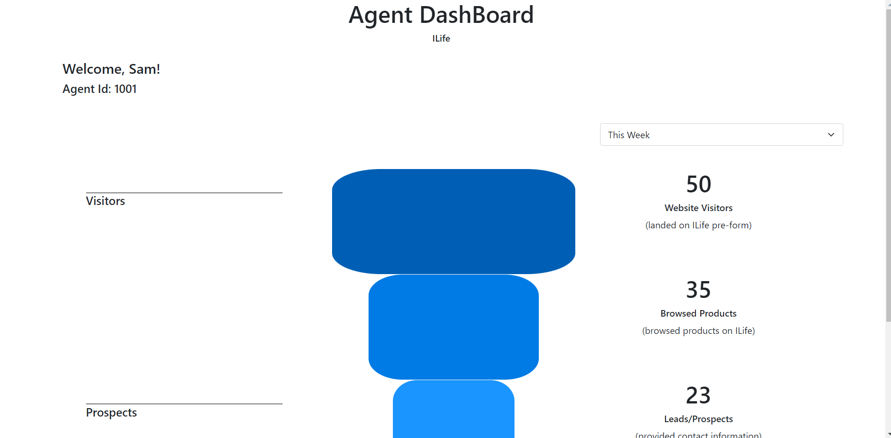

#### ilife_DemoReact

# React 

## DashBoard page

### At a glance
 * Displays *agentid* on top left 
 * Form select menu on top right
 * Data being retrieved via *GET* from API at the top right to bottom right

### API call
  * Form Select menu contains 4 options
  * each option has a value assigned to it
  *  *onChange* API call will be made
  * each value calls a specific path to the API
  * API returns data
  * Data is shown in its proper place

### API data 
 * Showing calls are being made properly and accepting correct values

## Java Spring Boot API
 * Rest Repositories
 * JPA
 * H2
 * Heroku Link -> http://warm-journey-80079.herokuapp.com/dash
 * GitHub Repo -> https://github.com/samg990/ilife_demoAPI

A quick api made with Spring Boot. Basic structured json. Ugly looking but for the purposes of the demo I needed something up and running. Deployed on Heroku.
React page is also ugly but again for the purposes of the demo functionality has precedent over styling. 

